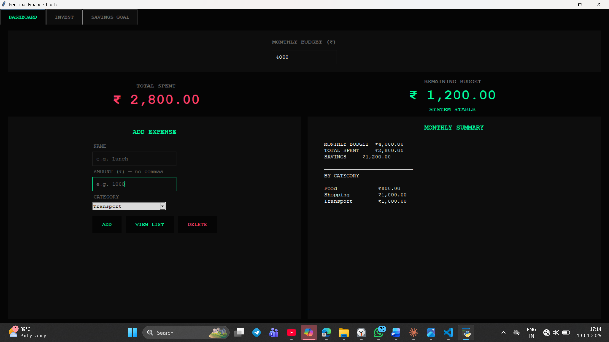
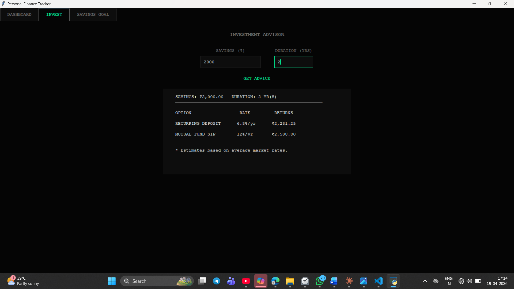

# Personal Finance Tracker

A desktop application built with Python and Tkinter to manage personal finances effectively.

## Features
- Dashboard with real-time budget tracking
- Add, view and delete expenses by category
- Monthly summary with category-wise breakdown
- Investment advisor with expected returns (FD, RD, SIP, Gold, Stocks)
- Savings goal tracker with progress bar

## Technologies Used
- Python
- Tkinter
- OS Module

## How to Run
1. Clone the repository
2. Open terminal in project folder
3. Run: python app.py

## Screenshots

### Dashboard

### Investment Advisor

### Savings Goal

