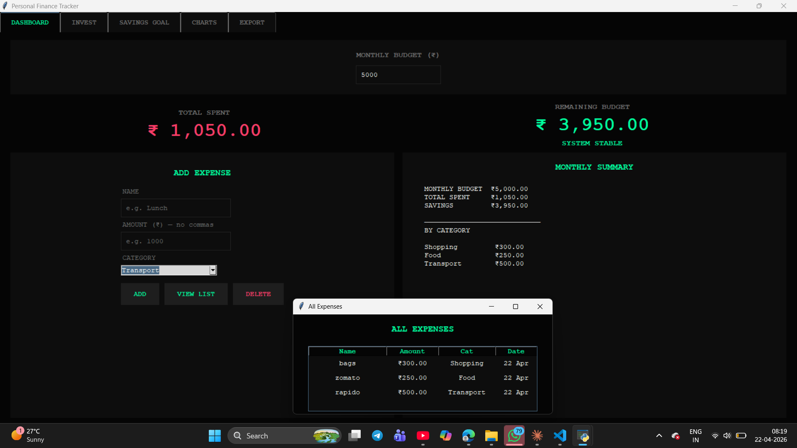
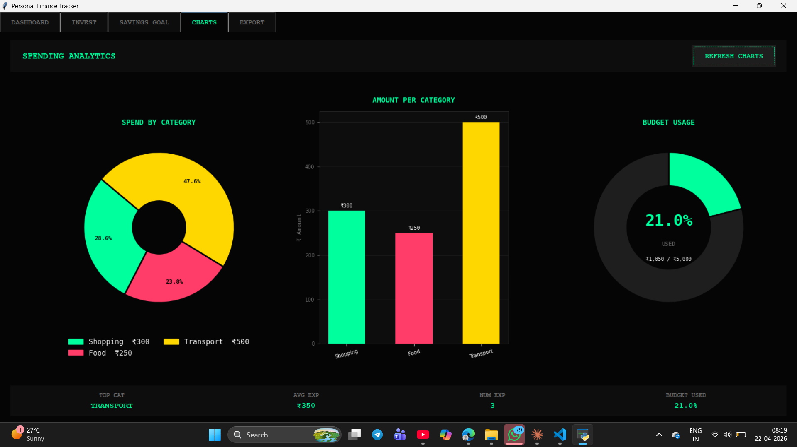
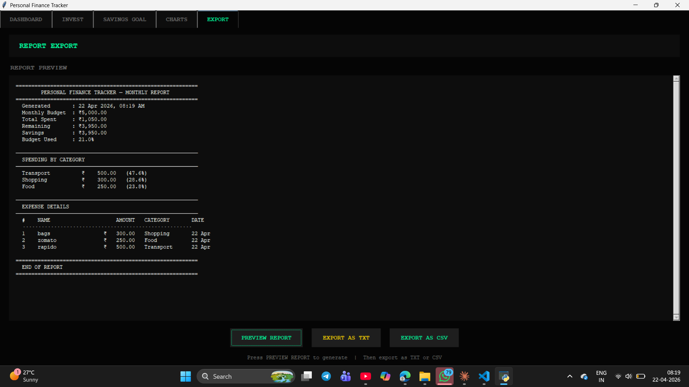

# 💰 Personal Finance Tracker

A dark-themed desktop finance app built with Python and Tkinter — track expenses, visualize spending, manage savings goals, and export monthly reports.

----
## 📸 Screenshots







---

## ✨ Features

- **Dashboard** — Set monthly budget, add/delete expenses, view real-time budget status with color-coded alerts (stable → warning → exceeded)
- **Charts** — Embedded Matplotlib visualizations: pie chart, bar chart, and a live budget usage gauge — all inside Tkinter
- **Investment Advisor** — Enter savings and duration to get estimated returns across FD, SIP, Gold, and Stock Market
- **Savings Goal Tracker** — Set a goal, add savings incrementally, track progress with a live progress bar
- **Report Export** — Generate and preview monthly reports, export as `.txt` or `.csv`

---

## 🛠️ Tech Stack

| Tool | Purpose |
|------|---------|
| Python | Core language |
| Tkinter | Desktop GUI |
| Matplotlib | Embedded charts (pie, bar, gauge) |
| CSV module | Data export |
| OS / Datetime | File handling, date stamping |

---

## 🚀 How to Run

**1. Clone the repository**
```bash
git clone https://github.com/YOUR_USERNAME/personal-finance-tracker.git
cd personal-finance-tracker
```

**2. Install dependencies**
```bash
pip install matplotlib
```

> Tkinter comes pre-installed with Python. If missing: `sudo apt-get install python3-tk`

**3. Run the app**
```bash
python finance.py
```

---

## 📁 Project Structure

```
personal-finance-tracker/
│
├── finance.py          # Main application file
├── README.md           # Project documentation
└── screenshots/        # App screenshots (add your own)
```

---

## 💡 How to Use

1. Open the app and go to **Dashboard**
2. Set your **Monthly Budget** at the top
3. Add expenses using the **ADD** button — name, amount, category
4. Switch to **Charts** tab to see spending breakdown visually
5. Use **Savings Goal** tab to track a specific target
6. Go to **Export** tab → Preview → Export as TXT or CSV

---

## 🎨 UI Design

- Dark monochrome theme (`#050505` background)
- Mint green (`#00FF9D`) / Rose red (`#FF3D68`) / Gold (`#FFD700`) accent colors
- Courier monospace font throughout
- Placeholder-enabled inputs with focus/blur handling

---

## 📊 Chart Details

| Chart | Type | What it shows |
|-------|------|----------------|
| Spend by Category | Donut (Pie) | % split across Food, Transport, etc. |
| Amount per Category | Bar | Exact ₹ amount per category |
| Budget Usage | Gauge | % of monthly budget consumed |

Color of gauge changes dynamically:
- 🟢 Green → Under 60% used
- 🟡 Gold → 60–80% used  
- 🔴 Red → Over 80% used

---

## 🔮 Future Plans

- [ ] Add SQLite database for persistent storage
- [ ] Flask web version for browser access
- [ ] Login/user authentication
- [ ] Monthly comparison charts

---

## 👩‍💻 Author

**Tanishka Malviya**  
B.Tech CSE, SAGE University Indore  
[LinkedIn](https://www.linkedin.com/in/tanishka-malviya-2b6b43375/) • [GitHub](https://github.com/tanishkamalviya19-jpg)
